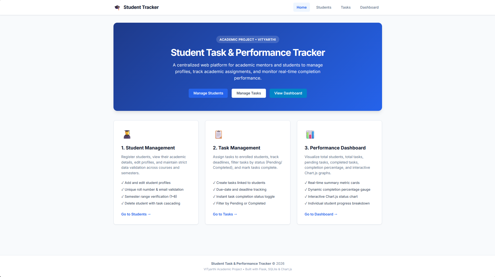
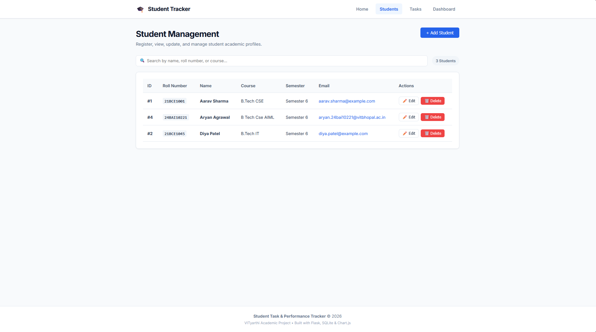
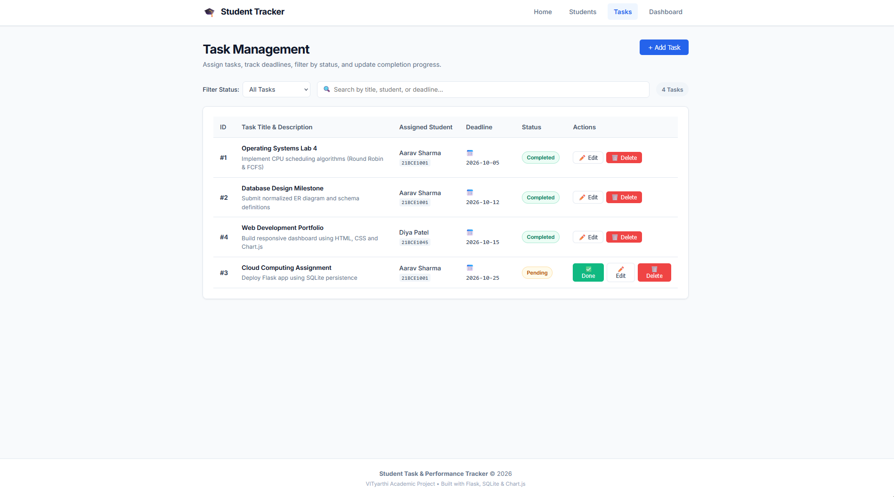
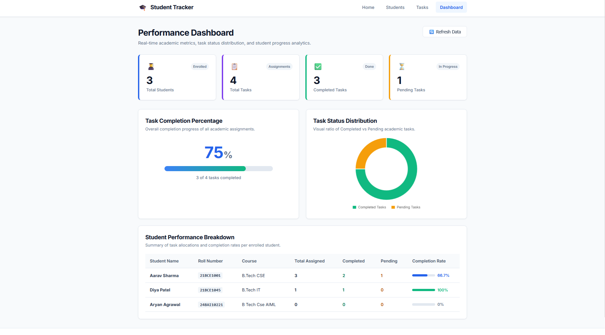

# Student Task & Performance Tracker

A clean, responsive, and lightweight academic web application designed to help academic mentors and students organize student profiles, assign and track course tasks, and monitor academic progress via an interactive performance dashboard.

---

## 1. Overview

The **Student Task & Performance Tracker** is developed as a **VITyarthi Build Your Own Project** academic submission. It centralizes student records, assignments, deadlines, and completion analytics into a single intuitive interface. The project is implemented using Python, Flask, SQLite, HTML5/CSS3/JavaScript, Chart.js, and Pytest.

---

## 2. Problem Statement

In contemporary academic settings, keeping track of deliverables, lab assignments, and project deadlines across hundreds of students across various courses and semesters is traditionally done using disconnected spreadsheets, chat groups, or paper records. This leads to:
- Disorganized task tracking and missed submission deadlines.
- Lack of instant visibility into individual and batch-wide academic completion rates.
- Inefficient student management and difficulty auditing past coursework.

This application provides a centralized, lightweight, and structured digital platform that unifies student record management, task tracking, and visual performance analytics.

---

## 3. Objectives

- **Centralize Student Records**: Store, view, update, and search enrolled student profiles with robust input validation and unique roll number / email constraints.
- **Streamline Task Management**: Create deliverables linked to students, monitor deadlines, filter pending and completed tasks, and allow quick status toggling.
- **Visualize Academic Progress**: Provide an interactive Performance Dashboard computing total metrics, percentage completion gauges, and visual Chart.js charts.
- **Ensure Code Quality & Reliability**: Maintain high reliability via parameterized SQL queries, error handling, clean modular separation, and comprehensive automated Pytest test coverage.

---

## 4. Features

### Module 1: Student Management
- **Add Student**: Register new students with Name, Roll Number, Course, Semester (1–8), and Email.
- **View Students**: Responsive table listing all enrolled students with live search filtering.
- **Edit Student**: In-place modal to modify existing student information with constraint protection.
- **Delete Student**: Safely delete student profiles with automatic cascade deletion of their assigned tasks.
- **Input Validation**: Rejects invalid emails, out-of-range semesters, empty fields, and duplicate records.

### Module 2: Task Management
- **Add Task**: Assign academic tasks to any enrolled student with title, description, deadline, and status.
- **View Tasks**: Searchable, responsive task list displaying task title, assigned student name, roll number, and due date.
- **Filter Tasks**: Toggle views instantly between "All Tasks", "Pending Only", and "Completed Only".
- **Mark Task as Completed**: Single-click completion action (`Pending` &rarr; `Completed`) with dynamic badge updates.
- **Edit & Delete Tasks**: Update task details or remove completed/obsolete tasks.

### Module 3: Performance Dashboard
- **Key Summary Cards**: Real-time counts of Total Students, Total Tasks, Completed Tasks, and Pending Tasks.
- **Completion Gauge**: Dynamic visual progress bar displaying overall completion percentage with zero-division safety.
- **Chart.js Visualization**: Interactive donut chart visualizing the ratio between completed and pending tasks.
- **Student Performance Breakdown**: Tabular overview showing tasks assigned, completed, pending, and completion percentage for each enrolled student.

---

## 5. Technologies & Tools Used

| Layer / Tool | Technology | Purpose |
| :--- | :--- | :--- |
| **Backend Framework** | Python 3.13 + Flask 3.1 | Application routing, REST API endpoints, template rendering |
| **Database** | SQLite3 | File-based relational storage with foreign keys and ACID transactions |
| **Frontend UI** | HTML5, CSS3, Vanilla JavaScript | Responsive layout, modal controls, asynchronous `fetch` requests |
| **Visualization** | Chart.js 4.4 | Client-side doughnut charts for performance analytics |
| **Testing Suite** | Pytest 9.1 | Automated unit and integration tests for APIs and views |
| **Version Control** | Git | Local version tracking and Git repository management |

---

## 6. Project Structure

```
student-task-performance-tracker/
├── app.py                     # Flask application factory, blueprints & error handlers
├── config.py                  # Environment configuration (development & testing)
├── database.py                # SQLite connection manager & parameterized queries
├── schema.sql                 # Database DDL schema, constraints, and indexes
├── requirements.txt           # Project dependencies (Flask, Pytest)
├── .gitignore                 # Excluded files (venv, *.db, cache)
├── statement.md               # VITyarthi project statement & scope document
├── README.md                  # Main project documentation & setup guide
├── routes/
│   ├── __init__.py            # Blueprint package initializer
│   ├── views.py               # View routes (/, /students, /tasks, /dashboard)
│   └── api.py                 # REST API endpoints for students, tasks, and stats
├── static/
│   ├── css/
│   │   └── style.css          # Custom responsive styling and theme variables
│   └── js/
│       ├── main.js            # Toast notifications, modal helpers & sanitization
│       ├── students.js        # Student CRUD operations & form validation
│       ├── tasks.js           # Task CRUD operations, filtering, & completion toggle
│       └── dashboard.js       # Metric updates & Chart.js graph rendering
├── templates/
│   ├── base.html              # Shared navigation, toast container, and footer layout
│   ├── index.html             # Home portal and module feature cards
│   ├── students.html          # Student directory table and Add/Edit modals
│   ├── tasks.html             # Task management table, status filter & modals
│   └── dashboard.html         # Performance metrics, completion bar & Chart.js chart
├── tests/
│   ├── __init__.py            # Test package initializer
│   ├── conftest.py            # Isolated test database fixture and test client
│   ├── test_students.py       # Pytest tests for student CRUD and validation
│   ├── test_tasks.py          # Pytest tests for task CRUD, status and filters
│   └── test_dashboard.py      # Pytest tests for dashboard calculation accuracy
└── docs/
    ├── architecture.md        # System architecture and non-functional requirements
    ├── workflow.md            # Operational workflows and Mermaid diagrams
    ├── use-case.md            # Use case specifications and actors
    ├── sequence-diagram.md    # Sequence diagrams for key user flows
    ├── class-diagram.md       # Class & entity relationships
    └── er-diagram.md          # Entity-Relationship diagram and table specs
```

---

## 7. Installation Steps

### Prerequisites
- Python 3.10+ installed on your system (tested on Python 3.13)
- Git installed (optional, for version control)

### Step-by-Step Setup

1. **Navigate to the project root directory**:
   ```bash
   cd "student-task-performance-tracker"
   ```

2. **Create a virtual environment**:
   ```bash
   python -m venv .venv
   ```

3. **Activate the virtual environment**:
   - On Windows (Command Prompt / PowerShell):
     ```powershell
     .\.venv\Scripts\activate
     ```
   - On Linux / macOS:
     ```bash
     source .venv/bin/activate
     ```

4. **Install required dependencies**:
   ```bash
   pip install -r requirements.txt
   ```

5. **Initialize the SQLite database**:
   ```bash
   flask --app app init-db
   ```
   *Expected output: `Database initialized successfully.`*

---

## 8. How to Run

1. **Launch the Flask application**:
   ```bash
   python app.py
   ```
   *Or using Flask CLI:*
   ```bash
   flask --app app run --port 5000
   ```

2. **Access the application**:
   Open your browser and navigate to:
   ```
   http://127.0.0.1:5000
   ```

3. **Explore the functional modules**:
   - **Home**: `http://127.0.0.1:5000/`
   - **Students**: `http://127.0.0.1:5000/students`
   - **Tasks**: `http://127.0.0.1:5000/tasks`
   - **Dashboard**: `http://127.0.0.1:5000/dashboard`

---

## 9. Testing Instructions

The project uses **Pytest** with automated test fixtures that run against an isolated, temporary SQLite database to ensure zero test pollution.

### Run the Test Suite
Execute the following command in the project root:
```bash
pytest -v
```

### Actual Test Execution Output
```
============================= test session starts =============================
platform win32 -- Python 3.13.12, pytest-9.1.1, pluggy-1.6.0
rootdir: C:\College\Semester 6\Vityarthi\student-task-performance-tracker
collected 14 items

tests/test_dashboard.py::test_dashboard_stats_empty_db PASSED            [  7%]
tests/test_dashboard.py::test_dashboard_stats_calculation PASSED         [ 14%]
tests/test_dashboard.py::test_view_routes_render_success PASSED          [ 21%]
tests/test_students.py::test_student_creation PASSED                     [ 28%]
tests/test_students.py::test_student_retrieval PASSED                    [ 35%]
tests/test_students.py::test_student_update PASSED                       [ 42%]
tests/test_students.py::test_student_deletion PASSED                     [ 50%]
tests/test_students.py::test_student_invalid_inputs PASSED               [ 57%]
tests/test_students.py::test_student_duplicate_constraints PASSED        [ 64%]
tests/test_tasks.py::test_task_creation PASSED                           [ 71%]
tests/test_tasks.py::test_task_completion PASSED                         [ 78%]
tests/test_tasks.py::test_task_deletion PASSED                           [ 85%]
tests/test_tasks.py::test_task_filtering_by_status PASSED                [ 92%]
tests/test_tasks.py::test_task_invalid_inputs PASSED                     [100%]

============================= 14 passed in 0.60s ==============================
```

---

## 10. Screenshots Section

### 1. Home Portal


### 2. Student Management


### 3. Task Management


### 4. Performance Dashboard



---

## 11. Future Enhancements

- **Email Reminders**: Automated notification service for upcoming assignment deadlines.
- **Role-Based Authentication**: Dedicated student and faculty sign-in views.
- **Export to CSV/PDF**: Downloadable gradebook and performance summary reports.
- **Priority Levels**: Ability to flag tasks as High, Medium, or Low priority.

---

## 12. References

1. **Flask Documentation**: [https://flask.palletsprojects.com/](https://flask.palletsprojects.com/)
2. **SQLite Documentation**: [https://www.sqlite.org/docs.html](https://www.sqlite.org/docs.html)
3. **Chart.js Documentation**: [https://www.chartjs.org/docs/latest/](https://www.chartjs.org/docs/latest/)
4. **Pytest Framework Documentation**: [https://docs.pytest.org/](https://docs.pytest.org/)
5. **MDN Web Docs (HTML/CSS/JS)**: [https://developer.mozilla.org/](https://developer.mozilla.org/)
6. **VITyarthi Academic Guidelines**: Build Your Own Project Specifications.
