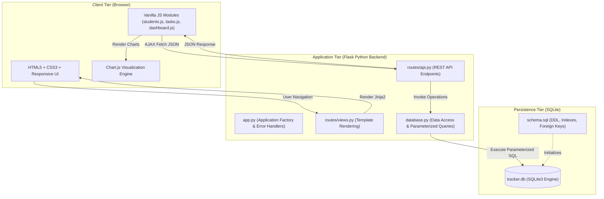

# System Architecture: Student Task & Performance Tracker

## 1. Overview

The **Student Task & Performance Tracker** follows a classic multi-tier Model-View-Controller (MVC) style architectural pattern tailored for a lightweight, self-contained academic environment.

---

## 2. Layer Breakdown

### A. Presentation Layer (Frontend)
- **HTML5 & Jinja2 Templates**: Structural skeleton (`base.html`, `index.html`, `students.html`, `tasks.html`, `dashboard.html`).
- **Responsive CSS3 (`style.css`)**: Custom styling without third-party CSS overhead, providing clean typography, cards, tables, badges, and modals.
- **Client-Side JavaScript (`main.js`, `students.js`, `tasks.js`, `dashboard.js`)**: Dynamic DOM rendering, asynchronous communication via the `fetch` API, modal transitions, and real-time toast feedback.
- **Chart.js Engine**: Renders interactive donut/pie graphs representing completed vs. pending task metrics.

### B. Controller & Application Layer (Backend)
- **Application Factory (`app.py`)**: Centralized initialization, configuration injection, error handling (400, 404, 500), and teardown management.
- **Views Blueprint (`routes/views.py`)**: Delivers rendered HTML pages to the browser.
- **REST API Blueprint (`routes/api.py`)**: Implements RESTful JSON endpoints for Student CRUD, Task CRUD, and Dashboard statistics computation.

### C. Data Access Layer (`database.py`)
- **Connection Lifecycle Management**: Opens connections per request with `PRAGMA foreign_keys = ON` and closes them via Flask teardown hooks.
- **Parameterized Queries**: Eliminates SQL injection vulnerabilities by binding parameters to SQLite statements.
- **Aggregate Computation**: Efficient SQL aggregations for dashboard summary metrics (`COUNT`, `SUM(CASE ...)`).

### D. Persistence Layer (`schema.sql` & SQLite)
- Compact, serverless, file-based relational storage in `tracker.db`.
- Foreign key constraints with `ON DELETE CASCADE` ensure referential integrity between students and their assigned tasks.

---

## 3. Non-Functional Architecture Requirements

1. **Usability**: Intuitive single-click actions, responsive layouts suited for mobile and desktop screens, instant toast alerts, and modal dialogs.
2. **Performance**: Lightweight footprint (< 1 MB assets), fast SQLite query execution indexed on roll numbers and statuses, and sub-millisecond API response times.
3. **Reliability**: Atomic SQLite transactions (`commit()` / `rollback()`), foreign key enforcement, and comprehensive edge-case handling (e.g., zero-division safeguards when calculating percentages).
4. **Security**: Full input sanitization, regular expression validation on emails and roll numbers, parameterized SQL queries to prevent SQL injection, and HTML character escaping in the frontend.
5. **Maintainability**: Modular structure separating routes, database operations, static assets, and templates into clean components.
6. **Error Handling**: Standardized HTTP status codes (200, 201, 400, 404, 409, 500) paired with structured JSON error messages (`{"success": false, "error": "..."}`).
