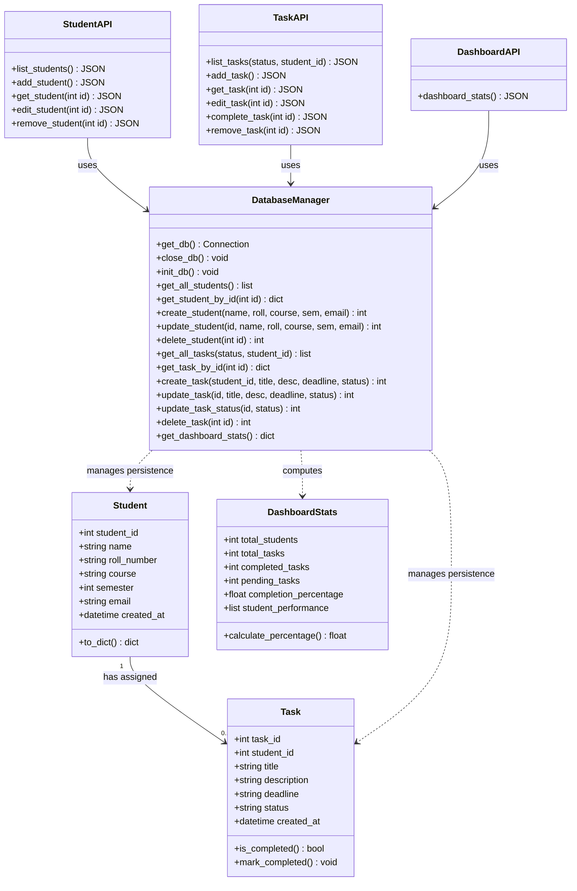

# Class Diagram: Student Task & Performance Tracker

This document presents the class structure, domain entities, and data models of the application.

---

## Class Descriptions

### 1. `Student`
Encapsulates an enrolled student profile.
- **Attributes**:
  - `student_id`: Primary identifier (auto-incremented integer).
  - `name`: Full student name.
  - `roll_number`: Unique institutional roll identifier.
  - `course`: Enrolled academic branch/program.
  - `semester`: Current academic semester (1 to 8).
  - `email`: Institutional or personal email address (unique).

### 2. `Task`
Represents an academic deliverable or assignment.
- **Attributes**:
  - `task_id`: Primary identifier.
  - `student_id`: Foreign key referencing the enrolled `Student`.
  - `title`: Short task name.
  - `description`: Detailed task instructions.
  - `deadline`: Submission target date (`YYYY-MM-DD`).
  - `status`: Lifecycle state (`Pending` or `Completed`).

### 3. `DashboardStats`
Represents aggregate calculations for performance reporting.
- **Attributes**:
  - `total_students`: Total active students.
  - `total_tasks`: Total created assignments.
  - `completed_tasks`: Assignments with status `Completed`.
  - `pending_tasks`: Assignments with status `Pending`.
  - `completion_percentage`: `(completed / total) * 100`.
  - `student_performance`: List of student-level task completion statistics.

### 4. `DatabaseManager`
Data access layer wrapping SQLite interactions with parameterized queries and transaction control.
