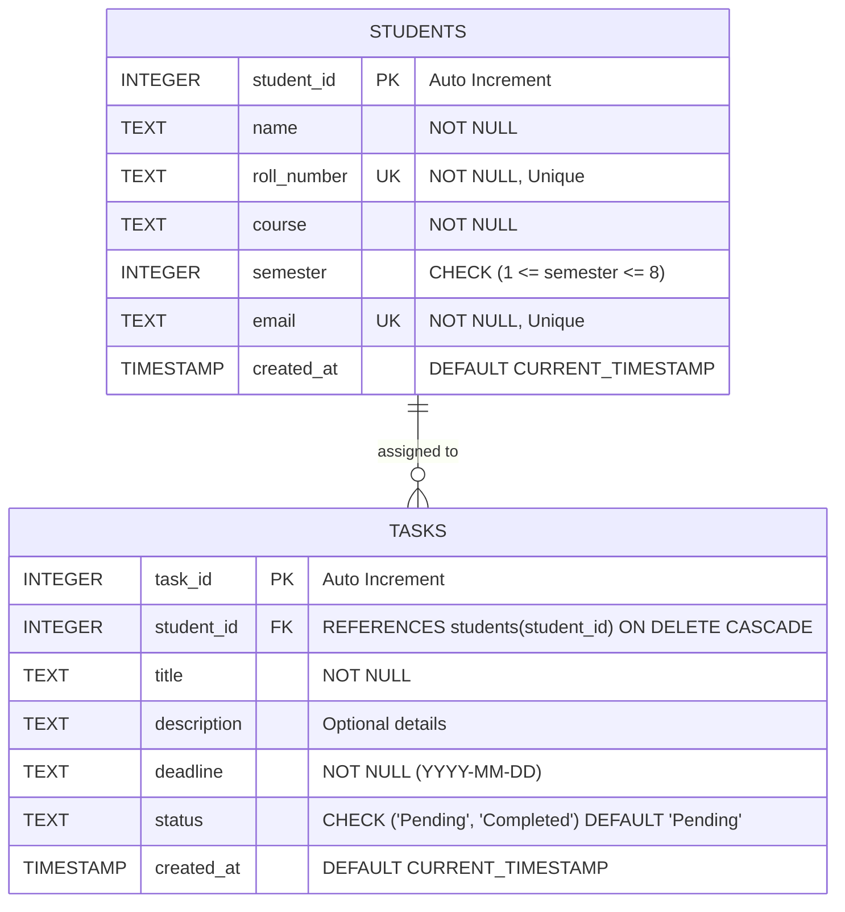

# Entity-Relationship (ER) Diagram: Student Task & Performance Tracker

This document presents the relational database design for the SQLite storage engine.

---

## 1. Table Specifications

### A. Table: `students`
Stores student academic profile information.

| Column Name | Data Type | Constraints | Description |
| :--- | :--- | :--- | :--- |
| `student_id` | `INTEGER` | `PRIMARY KEY AUTOINCREMENT` | Unique identifier for each student |
| `name` | `TEXT` | `NOT NULL` | Full name of the student |
| `roll_number` | `TEXT` | `NOT NULL UNIQUE` | Academic roll/registration number (indexed) |
| `course` | `TEXT` | `NOT NULL` | Degree or branch of study (e.g. B.Tech CSE) |
| `semester` | `INTEGER` | `NOT NULL CHECK (1-8)` | Current semester of enrollment |
| `email` | `TEXT` | `NOT NULL UNIQUE` | Contact email address (indexed) |
| `created_at` | `TIMESTAMP` | `DEFAULT CURRENT_TIMESTAMP` | Record creation timestamp |

### B. Table: `tasks`
Stores academic assignments linked directly to enrolled students.

| Column Name | Data Type | Constraints | Description |
| :--- | :--- | :--- | :--- |
| `task_id` | `INTEGER` | `PRIMARY KEY AUTOINCREMENT` | Unique identifier for each task |
| `student_id` | `INTEGER` | `NOT NULL, FK` | References `students(student_id)` with `ON DELETE CASCADE` |
| `title` | `TEXT` | `NOT NULL` | Assignment title / headline |
| `description` | `TEXT` | `DEFAULT ''` | Assignment details, instructions, rubric |
| `deadline` | `TEXT` | `NOT NULL` | Due date in `YYYY-MM-DD` ISO format |
| `status` | `TEXT` | `NOT NULL CHECK (Pending, Completed)` | Current progress state (indexed) |
| `created_at` | `TIMESTAMP` | `DEFAULT CURRENT_TIMESTAMP` | Record creation timestamp |

---

## 2. Integrity & Relational Rules

1. **Foreign Key Enforcement**: `PRAGMA foreign_keys = ON;` is executed on every database connection.
2. **Cascading Deletions**: If a student record is removed from `students`, all associated tasks in `tasks` are automatically purged through `ON DELETE CASCADE`.
3. **Uniqueness Guarantees**: Duplicate roll numbers or emails trigger a SQLite `IntegrityError`, caught gracefully by the API layer returning HTTP 409 Conflict.
4. **Domain Constraints**: `CHECK` constraints guarantee semesters are between 1 and 8, and statuses can only ever be `Pending` or `Completed`.
