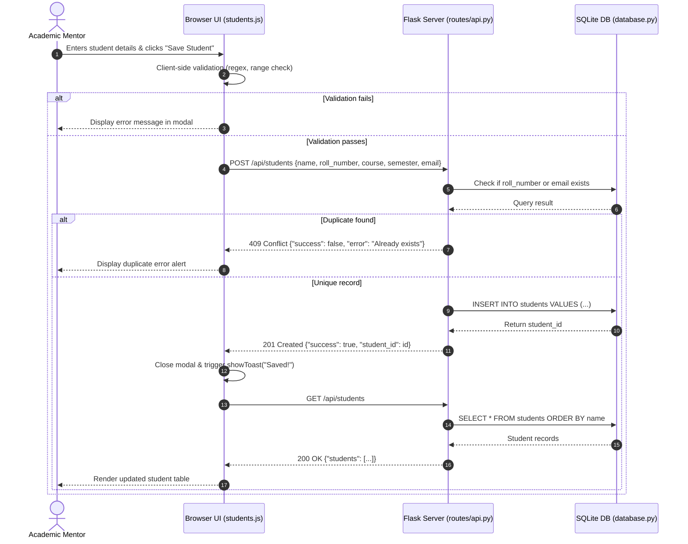
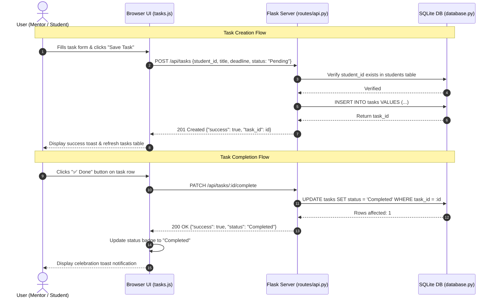
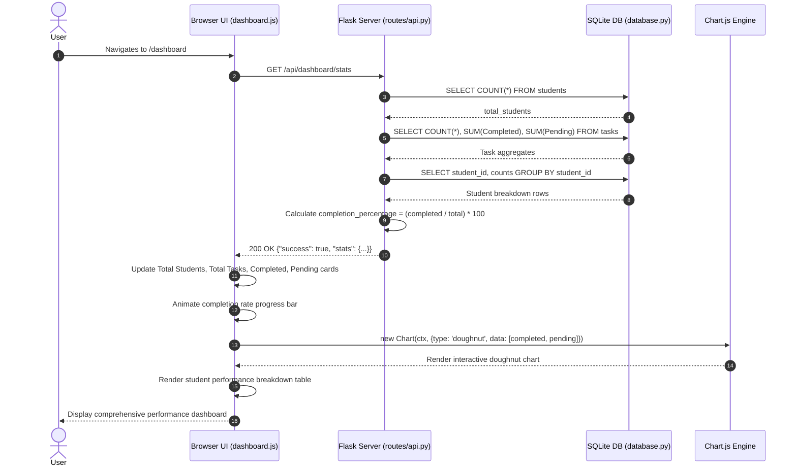

# Sequence Diagrams: Student Task & Performance Tracker

This document presents interaction sequences between the User, Web Browser, Flask Application, and SQLite Database.

---

## 1. Student Creation Sequence

---

## 2. Task Assignment & Completion Sequence

---

## 3. Performance Dashboard Statistics Sequence

