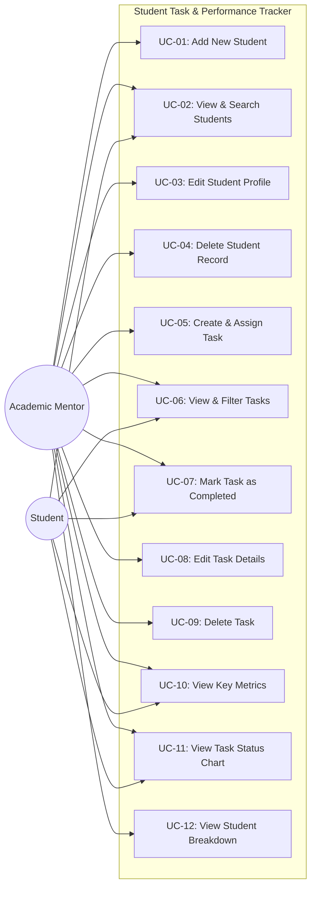

# Use Case Specification: Student Task & Performance Tracker

## 1. System Actors

| Actor | Role Description |
| :--- | :--- |
| **Faculty / Academic Mentor** | Manages student enrollments, assigns academic tasks, updates deadlines, monitors completion metrics, and tracks student progress. |
| **Student** | Views assigned coursework, tracks submission deadlines, and marks assignments as completed upon submission. |

---

## 2. Use Case Diagram

---

## 3. Detailed Use Case Specifications

### UC-01: Add New Student
- **Primary Actor**: Academic Mentor
- **Preconditions**: User is on the Student Management page.
- **Trigger**: Clicks "+ Add Student" button.
- **Main Success Scenario**:
  1. User enters student name, unique roll number, course, semester (1–8), and email.
  2. System validates format and verifies that roll number and email are unique.
  3. System saves record into SQLite database.
  4. System shows confirmation toast and displays the new student in the table.
- **Exceptions**: Roll number or email already exists &rarr; Displays error banner in modal.

### UC-05: Create & Assign Task
- **Primary Actor**: Academic Mentor
- **Preconditions**: At least one student is registered.
- **Trigger**: Clicks "+ Add Task" button.
- **Main Success Scenario**:
  1. User selects a student from the dropdown list.
  2. User inputs task title, optional description, deadline, and initial status (`Pending`).
  3. System validates required fields and date format (`YYYY-MM-DD`).
  4. System inserts record into the `tasks` table.
  5. System shows confirmation toast and refreshes the task table.

### UC-07: Mark Task as Completed
- **Primary Actor**: Academic Mentor / Student
- **Preconditions**: Task exists with `Pending` status.
- **Trigger**: Clicks "✅ Done" button on task row.
- **Main Success Scenario**:
  1. System issues a patch request to update status to `Completed`.
  2. Status badge updates dynamically to green "Completed".
  3. Dashboard stats automatically reflect the completed assignment.

### UC-10: View Performance Dashboard
- **Primary Actor**: Academic Mentor / Student
- **Preconditions**: Application is running.
- **Trigger**: Clicks "Dashboard" in navigation menu.
- **Main Success Scenario**:
  1. System requests aggregated statistics from `GET /api/dashboard/stats`.
  2. Metric summary cards show Total Students, Total Tasks, Completed Tasks, and Pending Tasks.
  3. Progress bar visualizes total task completion percentage.
  4. Chart.js displays a doughnut chart comparing completed vs. pending tasks.
  5. Table presents student-wise completion rates.
