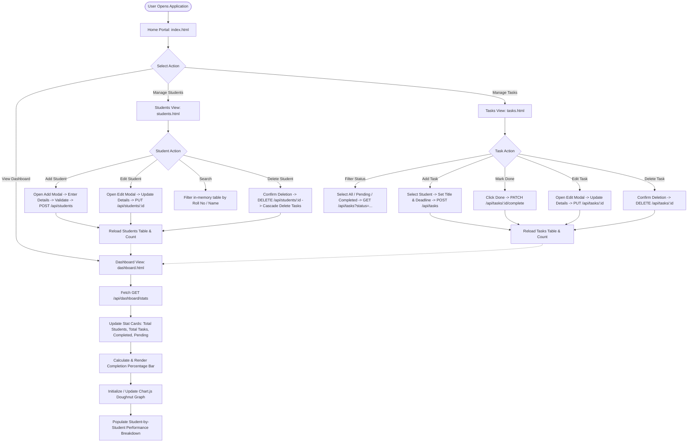

# System Workflow: Student Task & Performance Tracker

This document details the operational workflows and user journeys within the application.

## 1. End-to-End System Workflow

---

## 2. Detailed Process Flows

### Workflow A: Enrolling a Student
1. User navigates to the **Students** tab.
2. User clicks **+ Add Student** to open the modal.
3. User enters student name, roll number, course, semester (1–8), and email address.
4. Client-side JavaScript verifies that all fields are populated and follow the proper format.
5. Frontend issues a `POST /api/students` request with a JSON payload.
6. The Flask backend executes validation routines:
   - Verifies roll number and email uniqueness.
   - Enforces semester range constraints.
7. Backend inserts a new row into `students` table via parameterized SQL.
8. Frontend receives HTTP 201, closes the modal, fires a success toast, and refreshes the student list.

---

### Workflow B: Assigning and Completing a Task
1. User navigates to the **Tasks** tab.
2. User clicks **+ Add Task**.
3. Frontend dynamically fetches currently enrolled students to populate the student dropdown.
4. User selects the student, inputs title, description, deadline date, and initial status (`Pending`).
5. Frontend issues a `POST /api/tasks` request.
6. Backend verifies that the referenced `student_id` exists in the database and creates the task record.
7. When a student completes an assignment, the user clicks the green **Done** button next to that task.
8. Frontend issues a `PATCH /api/tasks/<id>/complete` request, updating the task status to `Completed`.
9. The table immediately updates the status badge from amber `Pending` to green `Completed`.

---

### Workflow C: Performance Analytics Generation
1. User navigates to the **Performance Dashboard**.
2. Frontend issues a `GET /api/dashboard/stats` request.
3. Backend runs aggregated SQL queries:
   - `COUNT(*)` for total students.
   - `SUM(CASE WHEN status = 'Completed' ...)` and `SUM(CASE WHEN status = 'Pending' ...)` for tasks.
   - Calculates `completion_percentage = (completed_tasks / total_tasks) * 100` (with 0.0 division safety).
   - Generates student-level task completion summaries.
4. Frontend updates metric counters and animates the completion percentage gauge.
5. Chart.js draws an interactive doughnut chart showing the ratio between completed and pending tasks.
